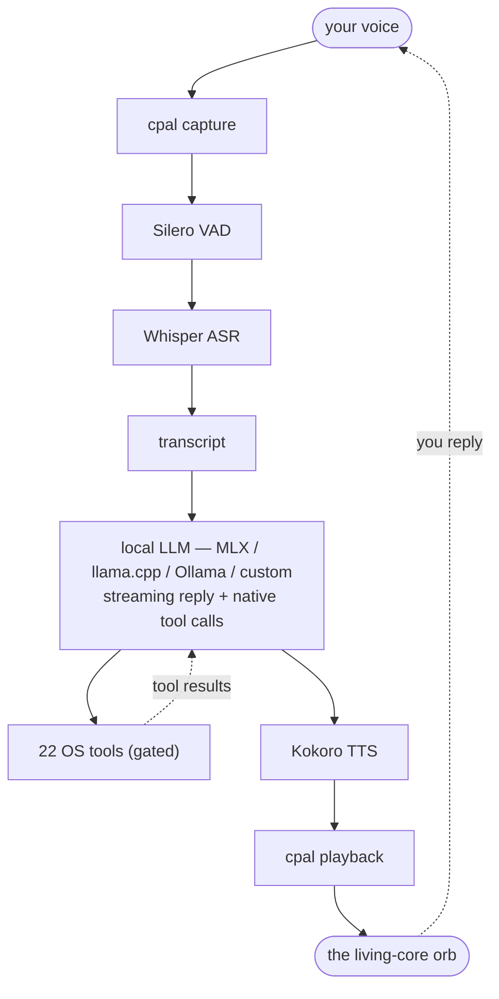

# Lo

**A fast, fully-local voice agent — pure-native Rust. No cloud, no webview, no Python.**

<p align="center">
  
</p>

Lo listens, thinks, and speaks entirely on your own machine. Talk to it hands-free
and it answers out loud, runs tools on your computer, and shows a living orb that
breathes with the conversation. Speech recognition, speech synthesis, voice-activity
detection, and the language model all run locally — nothing you say leaves your
device.

- **Hands-free or push-to-talk.** Just start talking; Lo detects when your sentence
  ends and replies. Or hold **Space** for push-to-talk at any time.
- **Everything on-device.** Whisper speech-to-text (GPU-accelerated per platform),
  Kokoro text-to-speech, Silero voice-activity detection, and a local LLM — no API
  keys, no network round-trips for the core loop.
- **It can actually do things.** 22 OS-action tools (web, files, shell, apps, media,
  clipboard, screenshots, timers, system info) behind a tiered safety gate.
- **One small native binary.** `winit` + `wgpu` for the UI, `cpal` for audio, all ML
  in Rust. No bundled browser, no sidecar processes.

---

## How it works



The brain is any OpenAI-compatible server: Lo can launch and supervise
`mlx_lm server` on Apple Silicon, auto-download and run a `llama-server` elsewhere,
talk to a local Ollama, or point at a custom URL. The right model tier is chosen
automatically from your machine's RAM.

## Install

Download the installer for your platform from the
[Releases](https://github.com/Rani367/lo/releases) page:

| Platform | Artifact |
|---|---|
| macOS (Apple Silicon / Intel) | `.dmg` (Metal + CoreML acceleration baked in) |
| Windows | `.msi` or `-setup.exe` |
| Linux | `.deb` or `.AppImage` |

> Release artifacts are currently **unsigned**. On macOS, right-click the app and
> choose **Open** the first time (or run `xattr -dr com.apple.quarantine /Applications/Lo.app`).
> On Windows, click through the SmartScreen prompt. Each release ships a
> `SHA256SUMS` file and a GitHub build-provenance attestation you can verify with
> `gh attestation verify <installer> --repo Rani367/lo` — see [SECURITY.md](SECURITY.md).

On first launch Lo downloads the speech and language models it needs (progress shows
in the captions); they're cached for offline use afterward.

## Talking to Lo

- **Hands-free (default).** Just speak. Lo's voice-activity detection segments your
  speech and ends the turn when you stop talking. It won't transcribe its own replies.
- **Push-to-talk.** Hold **Space**, speak, release — works at any time, even in
  hands-free mode, and interrupts Lo if it's mid-sentence (barge-in).
- **Push-to-talk only.** Prefer the mic to transcribe *only* while a key is held?
  Set `"activationMode": "ptt"` (below).

## Configuration

Settings live in `settings.json` in your OS config directory, merged over the
defaults — set only the keys you want to change:

- macOS: `~/Library/Application Support/com.lo.assistant/`
- Linux: `~/.config/com.lo.assistant/`
- Windows: `%APPDATA%\com.lo.assistant\`

| Key | Default | Notes |
|---|---|---|
| `model` | auto | Brain model; the default is picked by RAM (Qwen3 4B → 30B-A3B). Or set an explicit MLX id, GGUF ref, or Ollama tag. |
| `backend` | `auto` | `auto` (MLX on Apple Silicon, llama.cpp elsewhere), `mlx`, `llama`, `ollama`, or `custom`. |
| `activationMode` | `vad` | `vad` = hands-free (Space still does push-to-talk); `ptt` = push-to-talk only. |
| `voice` · `speechRate` | `af_heart` · `1.15` | Kokoro voice and speed. |
| `temperature` · `topP` · `topK` · `repeatPenalty` · `minP` | `0.6` · `0.95` · `40` · `1.1` · `0` | Sampling (top-k / penalty / min-p are sent to local backends only). |
| `vadPositiveThreshold` · `vadNegativeThreshold` · `vadRedemptionMs` | `0.6` · `0.4` · `900` | Hands-free sensitivity and end-of-turn silence. |
| `powerUserMode` | `false` | Enables the `confirm`/`danger` tools (write/move/copy/delete/run/quit/open). |
| `allowedFsRoots` | `[]` (→ home) | Folders the filesystem tools may touch. |
| `persistHistory` | `false` | Keep the rolling transcript across restarts. |
| `llmUrl` · `llmKey` | — | Custom OpenAI-compatible endpoint (when `backend` is `custom`). |

Environment overrides (handy for triage): `LO_LOG` (tracing filter), `LO_RAM_GB`
(force the model tier), `LO_WHISPER_CPU=1` (force CPU speech-to-text), `LO_NO_MIC`
(run the GUI with no audio), `LO_VAD_POSITIVE` / `LO_VAD_NEGATIVE` /
`LO_VAD_REDEMPTION_MS` (tune hands-free), and `LO_LLM_URL` / `LO_LLM_MODEL` /
`LO_LLM_KEY` (custom endpoint).

## Tools

Lo can take actions on your behalf. Each tool has a safety tier; the **safe** tier
runs immediately, while **confirm** and **danger** tools require `powerUserMode` and
are recorded in an audit log.

- **Safe** — web search & page fetch, current date/time, system info, open/focus an
  app, set volume, media controls, set a timer, take a screenshot, read/write the
  clipboard, read a file, list a directory, search file names.
- **Confirm** — quit an app, open a path in its default application.
- **Danger** — write, move, copy, or delete a file; run a shell command.

Filesystem tools are sandboxed to `allowedFsRoots` (your home directory by default),
web access is guarded against SSRF, and `run_command` is argv-only with a timeout and
an output cap. See [SECURITY.md](SECURITY.md) for the full model.

## Build from source

Requires **Rust 1.85+**. The default `ml` feature builds the on-device ML stack
(whisper.cpp via `whisper-rs`), which needs a C/C++ toolchain and **CMake**. To build
without it (clean stubs replace the ML engines), use `--no-default-features`.

```bash
cargo run -p lo                                # launch the app
cargo run -p lo -- --smoke                     # headless: resolved model tier + subsystems
cargo run -p lo -- --turn "what time is it"    # headless single agent turn (needs a brain server)

cargo test  --workspace --no-default-features  # fast core + binary tests (ML off)
cargo test  -p lo                              # ML-on tests
cargo clippy --workspace --all-targets -- -D warnings
cargo fmt --check
```

### GPU acceleration

macOS builds bake in **Metal + CoreML** by default (they need only the Xcode command
line tools that the whisper.cpp build already requires). On Linux/Windows the default
build is CPU-only for portability; opt in to a GPU backend with a Cargo feature (each
needs its vendor SDK):

```bash
cargo build -p lo --release --features ml,asr-cuda      # NVIDIA (CUDA Toolkit)
cargo build -p lo --release --features ml,asr-vulkan    # cross-vendor (Vulkan SDK)
cargo build -p lo --release --features ml,asr-hipblas   # AMD ROCm (Linux)
```

> Lo's on-device ML depends on the ONNX Runtime `2.0.0-rc` line and `kokoro-tts`
> `0.3.x`; these are pre-1.0 upstreams expected to stabilize in point releases.

## Architecture

```
crates
├── lo                          # the binary: winit/wgpu UI, cpal audio, on-device ML, glue
│   ├── assets
│   │   ├── icons
│   │   │   ├── icon.icns
│   │   │   ├── icon.ico
│   │   │   └── icon.png
│   │   ├── linux
│   │   │   └── lo.desktop
│   │   └── macos
│   │       └── Info.plist
│   ├── src
│   │   ├── app                 # winit handler + turn/epoch state machine
│   │   │   ├── mod.rs
│   │   │   └── state.rs
│   │   ├── audio               # cpal duplex: capture, playback, resample, spectrum
│   │   │   ├── capture.rs
│   │   │   ├── mod.rs
│   │   │   ├── playback.rs
│   │   │   ├── resample.rs
│   │   │   └── spectrum.rs
│   │   ├── backends            # process supervision for MLX / llama-server
│   │   │   ├── download.rs
│   │   │   ├── managed_server.rs
│   │   │   └── mod.rs
│   │   ├── brain               # streaming HTTP client (retry/backoff)
│   │   │   └── mod.rs
│   │   ├── gui                 # wgpu orb pass + egui captions
│   │   │   ├── captions.rs
│   │   │   ├── mod.rs
│   │   │   └── orb.rs
│   │   ├── ml                  # whisper-rs ASR / Kokoro TTS / Silero VAD
│   │   │   ├── asr.rs
│   │   │   ├── download.rs
│   │   │   ├── mod.rs
│   │   │   ├── tts.rs
│   │   │   └── vad.rs
│   │   ├── tools               # the OS-action tool bodies (web/files/shell/…)
│   │   │   ├── clipboard.rs
│   │   │   ├── desktop.rs
│   │   │   ├── files.rs
│   │   │   ├── media.rs
│   │   │   ├── mod.rs
│   │   │   ├── shell.rs
│   │   │   ├── system.rs
│   │   │   ├── timer.rs
│   │   │   └── web.rs
│   │   ├── events.rs           # inter-thread message contracts
│   │   ├── listen.rs           # capture-draining ASR/VAD thread
│   │   ├── main.rs             # entry + threading; graceful shutdown
│   │   └── worker.rs           # tokio agent loop + TTS thread
│   └── Cargo.toml
└── lo-core                     # pure logic — no GPU/audio/ML deps; exhaustively unit-tested
    ├── assets
    │   └── shaders
    │       └── orb.wgsl
    ├── src
    │   ├── backends            # engine selection, model RAM ladder, download URLs
    │   │   ├── download.rs
    │   │   ├── mod.rs
    │   │   └── models.rs
    │   ├── brain               # agent loop + SSE parsing
    │   │   ├── mod.rs
    │   │   ├── sse.rs
    │   │   └── types.rs
    │   ├── config              # settings, paths, persona, history, options
    │   │   ├── history.rs
    │   │   ├── mod.rs
    │   │   ├── options.rs
    │   │   ├── paths.rs
    │   │   └── persona.rs
    │   ├── tools               # registry, safety gate, audit, sandbox, SSRF guard
    │   │   ├── audit.rs
    │   │   ├── mod.rs
    │   │   ├── sandbox.rs
    │   │   ├── shell.rs
    │   │   └── ssrf.rs
    │   ├── lib.rs
    │   ├── shaders.rs
    │   ├── text.rs             # TTS sentence chunking + directive stripping
    │   └── types.rs
    └── Cargo.toml
```

`lo-core` holds everything that needs no GPU/audio/ML native toolchain, so it builds
in seconds and is exhaustively unit-tested; the `lo` binary layers `winit`/`wgpu`/
`cpal`/`whisper-rs`/`ort` on top and drives it. The winit event loop owns the main
thread; a tokio worker runs the brain loop, backends, and tools; on-device ML runs on
dedicated threads, and barge-in is coordinated by an epoch channel.

## Packaging & release

```bash
cargo install cargo-packager --locked
cd crates/lo
cargo packager --release -f dmg              # macOS
cargo packager --release -f deb,appimage     # Linux
cargo packager --release -f wix,nsis         # Windows
```

Tagging `vX.Y.Z` runs `.github/workflows/release.yml`, which builds and packages on
macOS (arm64 + x64), Windows, and Linux and uploads the installers to a draft GitHub
Release. Artifacts are unsigned until the signing secrets (`APPLE_*`,
`WINDOWS_CERT_THUMBPRINT`) are filled in; the slots are already wired in the workflow
and `crates/lo/Cargo.toml`.

## Troubleshooting

- **macOS "can't be opened" (unsigned):** right-click the app → **Open** the first
  time, or `xattr -dr com.apple.quarantine /Applications/Lo.app`.
- **No microphone prompt / capture fails:** the `.app` bundle carries the microphone
  usage description; a bare `cargo run` binary won't — use `LO_NO_MIC` to launch the
  GUI without audio, or run the packaged app.
- **Speech recognition is slow / GPU issues:** set `LO_WHISPER_CPU=1` to force CPU.
- **First launch is slow:** the brain model plus the speech models download once
  (progress shows in the captions) and are cached for offline use after.

## Contributing

See [CONTRIBUTING.md](CONTRIBUTING.md). Please run `cargo fmt --check`,
`cargo clippy -- -D warnings`, and the test suite before opening a pull request.

## License

© 2026 Rani367. All rights reserved.

Lo's source is published for viewing and reference only — it is **not** open
source. You may read the code and run the official released builds for personal
use, but copying, modifying, redistributing, or reusing it in other projects is
not permitted without written permission. See [LICENSE](LICENSE) for the full
terms.
